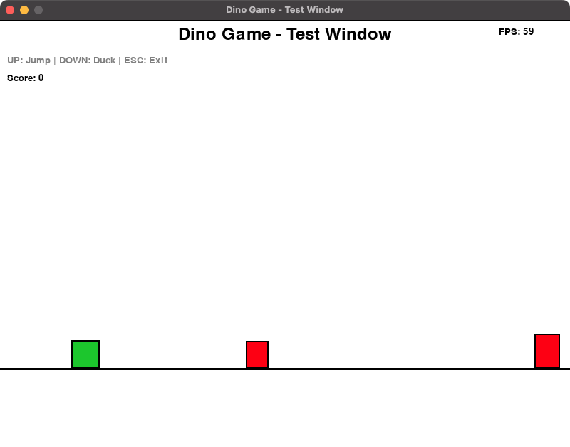

# Dino

    <!---->
    

Yes dino game. Used for Evolutionary Algorithm project.

This game currently doesn't run for me with Python 3.14. You may need to use [pyenv](https://github.com/pyenv/pyenv) to switch to 3.12

To run game, just run the `run.bat`(Windows) or `run.sh`(*Nix) script, and it will automatically create a virtual environment, and install all the requirements for you

### Contributors
- [jeffrey-petra](https://github.com/jeffrey-petra)
- [astraalunaa](https://github.com/astraalunaa)
